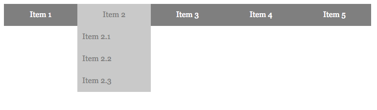

# Pure CSS Dropdown Menu

Example of Simple CSS Dropdown Menu




## Usage

Link CSS

```html
<link rel="stylesheet" href="/path/to/menu.css">
```

Prepare your HTML

```html
<ul id="menu">
	<li><a href="#">Item 1</a></li>
	<li>
		<a href="#">Item 2</a>
		<ul>
			<li><a href="#">Item 2.1</a></li>
			<li><a href="#">Item 2.2</a></li>
			<li><a href="#">Item 2.3</a></li>
		</ul>
	</li>
	<li>
		<a href="#">Item 3</a>
		<ul>
			<li><a href="#">Item 3.1</a></li>
			<li><a href="#">Item 3.2</a></li>
			<li><a href="#">Item 3.3</a></li>
			<li><a href="#">Item 3.4</a></li>
			<li><a href="#">Item 3.5</a></li>
		</ul>
	</li>
	<li>
		<a href="#">Item 4</a>
		<ul>
			<li><a href="#">Item 4.1</a></li>
		</ul>
	</li>
	<li>
		<a href="#">Item 5</a>
		<ul>
			<li><a href="#">Item 5.1</a></li>
			<li><a href="#">Item 5.2</a></li>
			<li><a href="#">Item 5.3</a></li>
			<li><a href="#">Item 5.4</a></li>
			<li><a href="#">Item 5.5</a></li>
		</ul>
	</li>
</ul>
```

## Demo

 - [menu demo](http://yuliyawebdevelopment.com/demos/css-dropdown-menu/)
 
 
